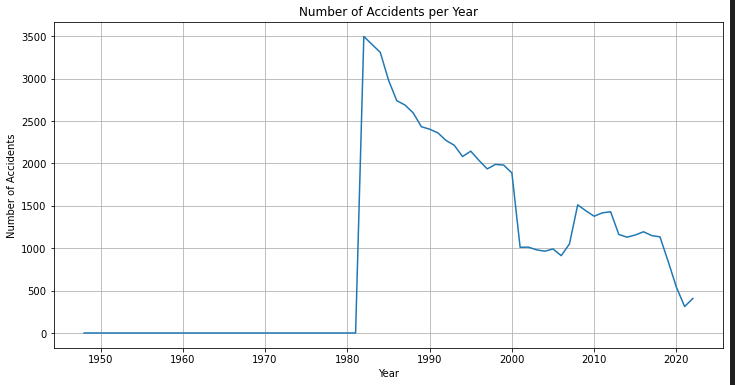
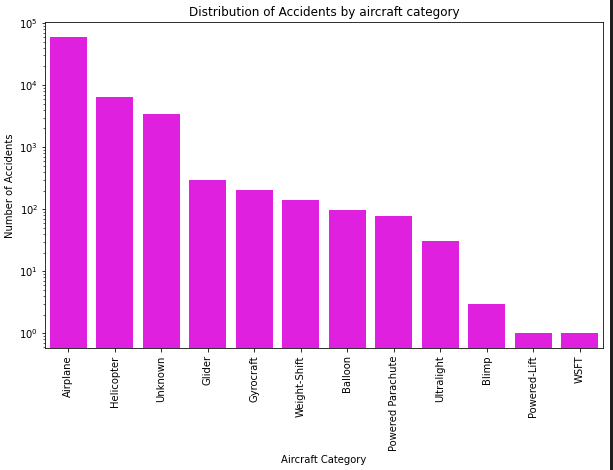
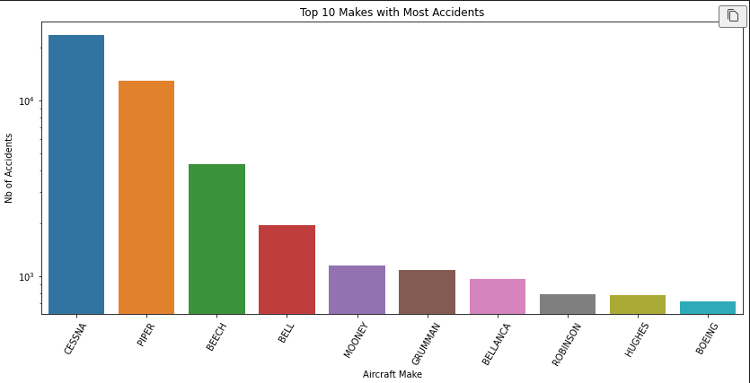

- [Accident\_Aviation\_Project 2024](#accident_aviation_project-2024)
- [Overview](#overview)
- [Business Understanding](#business-understanding)
  - [Key Stakeholders](#key-stakeholders)
  - [Core Business Questions](#core-business-questions)
- [Data Understanding and Analysis](#data-understanding-and-analysis)
  - [Source of Data](#source-of-data)
  - [Description of Data](#description-of-data)
  - [Data Cleaning](#data-cleaning)
- [Visualizations](#visualizations)
  - [Accident Frequency Over Time](#accident-frequency-over-time)
  - [Accidents by Aircraft Category](#accidents-by-aircraft-category)
  - [Accidents by Aircraft Make](#accidents-by-aircraft-make)
- [Conclusion](#conclusion)
  - [Summary of Findings](#summary-of-findings)
- [Contact Information:](#contact-information)

# Accident_Aviation_Project 2024

# Overview

Welcome to my comprehensive analysis repository focused on evaluating the safety of aircraft makes and models using historical accident data. My objective is to deliver data-driven insights that allow our company to invest in the aviation industry regardless of all the risks involved.

# Business Understanding

My main from a business perspective, is to provide data-driven insights into the safety records of various aircraft makes and models, utilizing historical accident data. By performing this analysis, we seek to:

    i. Guide airlines, private owners, and other stakeholders in the aviation industry in selecting aircraft  with lower accident rates.
    ii.Enhance safety, reduce risk, and support informed decision-making within the industry.

## Key Stakeholders

    1. Airlines
    2.Private Owners
    3.Aircraft Manufacturers
    4. Regulatory Bodies
    5.Insurance Companies

## Core Business Questions

    1.Which aircraft makes and models exhibit the lowest accident rates?
    1. What are the main factors contributing to accidents for different aircraft types?
    2. How can stakeholders improve safety, reduce risks and stay profitable?

# Data Understanding and Analysis

## Source of Data
The data used in this analysis is sourced from historical aviation accident databases, which provide detailed records of incidents involving various aircraft makes and models from 1948 to 2022.

## Description of Data
The dataset contains certain columns:

1. Make: Manufacturer of the aircraft.
2. Model: Specific model of the aircraft.
3. Aircraft.Category: Type of aircraft (e.g., Airplane, Helicopter).
4. Event.Date: Date of the accident.
5. Broad.phase.of.flight: Phase of flight during the accident.
6. Location: Geographic location of the accident.
7. Aircraft.damage: Extent of damage to the aircraft

## Data Cleaning
    i. I Filled missing values in Broad.phase.of.flight values as per similar accidents or marked as 'Unknown'.
    ii.Then I used Make column to fill missing Aircraft.Category values (i.e, 'Cessna' = 'Airplane').
    iii.Dropped columns that were not used in  visualization.

# Visualizations

## Accident Frequency Over Time

X-axis: Event.Date
Y-axis: Count of Accidents
Purpose: Show trends over time.
Type: Line chart

## Accidents by Aircraft Category

X-axis: Aircraft.Category
Y-axis: Count of Accidents
Purpose: Show accidents by category.
Type: Bar chart

## Accidents by Aircraft Make

X-axis: Make
Y-axis: Count of Accidents
Purpose: Show which makes have the most accidents.
Type: Bar chart.

# Conclusion

## Summary of Findings
Based on the analysis, I recommend the following actions:

    1.Select Safer Aircraft Makes: Prioritize aircraft makes that have a lower incidence of accidents to enhance safety.
    2.Improve Safety Protocols: Concentrate on bolstering safety measures during flight phases that exhibit higher accident rates.
    3.Collaborate with Manufacturers: Engage with manufacturers of aircraft models with higher accident rates to identify and address potential safety risks.

# Contact Information:

- **Project Lead**: [Peter Maina]
- **Email**: [mpwanyoike@gmail.com]
- **GitHub Repo**: [https://github.com/Mr-PeterMaina/Accident_Aviation_Project]
- **Tableau Repo**: [[Dashboard](https://public.tableau.com/app/profile/mr.petermaina/viz/TableauProjects101/Dashboard1)]